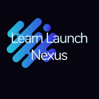

<p align="center">



# Learn Launch Nexus


Welcome to the Learn Launch Nexus README! This document provides an in-depth overview of the project's structure, files, components, and intricacies.

 

## Table of Contents

- [Tech Stack](#tech-stack)
- [Video Demo](#video-demo)
- [Introduction](#introduction)
- [What does the app do?](#what-does-the-app-do)
- [Challenges & Learnings](#challenges--learnings)
- [Research Undertaken](#research-undertaken)
- [Project Structure](#project-structure)
- [Getting Started](#getting-started)
- [Features](#features)
- [Styling](#styling)
- [API Integration](#api-integration)
- [Testing Suites](#testing-suites)
- [Contributing](#contributing)
- [License](#license)
- [Contributors](#contributors)

## Tech Stack
 


## Video Demo

 

https://github.com/gschool-blue-ocean/learnlaunchnexus/assets/127983785/8565d71d-8636-4521-9d40-8c75d2ab0332


## Introduction

The Learn Launch Nexus Application is a web-based platform designed to assist students and administrators within a learning institution. This README provides comprehensive insights into the project's structure, features, components, and testing suites.

## What does the app do?

**Problem & Solution**: Many institutions struggle with remote learning due to a lack of efficient tools. Our application provides a unified platform for students to access assignments, get feedback, and manage their schedules.

**Users**: The primary users are students and administrators/teachers of a learning institution.

**Purpose**: Built to bring convenience and efficiency to the e-learning experience.

**User Input & Output**: Students can submit assignments, check schedules, and manage tasks. Administrators can grade assignments, update schedules, and manage  all student submissions.


## Challenges & Learnings 

**Technical Challenges**
**Anticipated:** Integrating third-party authentication without compromising security.

**Plan:** We decided to use OAuth with JWT tokens.

**Learnings:** Gained a deeper understanding of secure authentication processes.

**Unexpected Challenges**

**Todo List Creation and Syncing:** Establishing a unique and functional Todo list for each user.

**Challenge:** Ensuring that every Todo list created was effectively linked and synced to its respective user ID, making sure that users only have access to their personalized lists and not those of others.

**Learnings:** Recognizing the significance of secure data handling and management. We also understood the nuances of creating features that cater to individual user preferences and privacy.

## Research Undertaken

When developing a software application, especially one with a variety of complex features, extensive research is often required to ensure effective implementation and integration of these features. Here's a summary of the research we undertook:

- **User Data Security**: As we aimed to link Todo lists to individual user IDs, we needed to ensure that this data linkage was secure. We researched modern security practices, focusing on user data protection.

- **Database Design**: To accommodate the unique Todo lists for each user and the respective linking with user IDs, we explored various database design patterns. Our aim was to ensure efficient data retrieval and minimal redundancy.

- **UI/UX Research**: To provide an intuitive user experience, we researched contemporary UI/UX designs, focusing on ease of use and accessibility.

- **Performance Optimization**: We researched best practices to optimize our application's performance, ensuring swift load times and responsive interactions.

- **Testing and Quality Assurance**: We wanted to ensure our application was robust and free from critical bugs. We looked into automated testing frameworks and methodologies suited for our tech stack.

This research was vital in guiding our development process, ensuring that we were implementing features using industry best practices and that the final product would be of high quality.


## Project Structure

The project adheres to a structured organization that promotes maintainability and modularity as follows:

### Public Directory

The public directory holds static assets like images and the HTML file that serves as the entry point for the application.

### Source Directory

The src directory contains the core application code, organized into various subdirectories:

- components: Contains reusable React components grouped by their respective functionalities.
- css: Holds CSS module files for styling components.
- pages: Includes top-level pages that are rendered based on routes.
- index.js: The main entry point of the application.

## Getting Started

### Prerequisites

Before you begin, ensure you have the following tools installed:

- Node.js
- npm (Node Package Manager)

### Installation

1. Clone the repository:

   ```bash
   git clone https://github.com/yourusername/learnlaunchnexus.git
   cd learnlaunchnexus
   ```

2. Install dependencies:

   ```bash
   npm install
    
   ```

### Running the App

1. Start the application:

   ```bash
   npm run build
   npm run dev_deploy
   ```

2. Access the application in your browser at your localhost.

### Configuration

The application uses environment variables for configuration. Create a `.env` file in the project root and configure variables such as database URLs, API endpoints, and secrets that come in the .env example file.

## Features

- **User Authentication**: Securely authenticate users using their email and password.

- **User Roles**: Distinguishes between student and administrator roles, with role-specific functionalities.

- **Dashboard**: Offers users an overview of:
  - Tasks
  - Assignments
  - Personal settings
  - User-specific details such as name and location. For students, it includes the desired location.

- **Assignment Submissions**: A platform where:
  - Students can submit assignments.
  - Administrators can provide feedback.

- **Setting Dropdown**: Exclusive to administrators, features include:
  - Changing user emails
  - Assigning administrative privileges to users

- **Calendar**: Allows users to:
  - View dates
  - Plan and manage tasks

- **Todo List**: Enhances user productivity by allowing task management.

- **Responsive Design**: Optimized for various devices, ensuring a seamless user experience.

## Styling

- Uses CSS modules to ensure styles are component-specific.
- All styles are found in the `css` directory and are imported into components as needed.

## API Integration

- Seamless interaction with an API for data processes.
- Configuration of the API base URL via environment variables.

## Testing Suites

Ensures the project's reliability by offering comprehensive tests for:

- **Login**: Secure authentication process.
  
- **User Roles**: Role-specific functionalities and access.

- **Productivity Features**: Focus on the Todo List and Calendar functionalities, emphasizing task management and date selection.


  # Workflow and Key Lessons from the Learn Launch Nexus Team

In this section, we'll detail our team's experiences, processes, and key takeaways from the project development. We'll touch upon our use of Agile methodologies, our Continuous Integration/Continuous Deployment (CI/CD) strategies, testing practices, and more.

## Table of Contents

- [Agile Process](#agile-process)
- [Git Workflow](#git-workflow)
- [CI/CD Strategy](#cicd-strategy)
- [Key Takeaways](#key-takeaways)
- [Testing](#testing)
- [Jira Board](#jira-board)

## Agile Process

### User Stories

Our user stories were crafted after extensive discussions with our client. These narratives helped keep the user in the center of our development.

### Ticketing

We utilized Jira for our ticketing system. Each ticket was associated with a feature our issue, ensuring that all features we developed had real-world significance.

### Stand-ups

Our daily stand-ups provided updates on our project. They ensured everyone was aligned, blockers were addressed, and the team was continuously moving forward.

## Git Workflow

We adopted the feature-branch workflow:

1. For every new feature or bugfix, a new branch  with the ticket name was created.
2. Once the feature was completed and tested, a pull request (PR) was raised.
3. The PR was reviewed by peers, ensuring code quality and consistency.
4. After approval, it was merged into the development branch.

### Commit Guidelines

- Use clear and concise commit messages.
- Every commit should represent a single logical change.
- Reference ticket numbers from Jira in commits related to those tickets.


## CI/CD Strategy

- On every PR, our CI pipeline ran lint checks and unit tests.
- Once merged, CD took over and deployed the changes to our staging environment.
- Post staging verification, changes were promoted to production.

## Key Takeaways

- **Code Reviews**: They were instrumental in maintaining code quality. Peer reviews helped in knowledge sharing and avoiding potential pitfalls.
- **Stakeholder Feedback**: Regular feedback loops ensured we were on the right track and the product met user needs.
- **Agile Flexibility**: Adopting Agile allowed us to pivot our strategy based on new information, ensuring a product-market fit.

## Testing

Testing was a major component of our development process.

- **Unit Tests**: Covered individual components of our code.
- **Integration Tests**: Ensured different parts of our application worked together seamlessly.
- **End-to-end Tests**: Validated our application's workflows from a user's perspective.

## Jira Board

Our Jira board was pivotal in tracking our progress. You can view our board [here](https://www.jira.com).

On the board, you'll find:

- **Completed Tickets**: These tickets have met the Definition of Done and passed all acceptance criteria.
- **In Progress**: Tasks currently being worked on.
- **Backlog**: Tasks prioritized for the future.


## Contributing

To contribute, fork the repository, create a new branch, commit your changes, and open a pull request.

## License

This project is licensed under the MIT License.

Feel free to explore the project's components, features, and functionalities. For more detailed instructions or customization guidelines, refer to specific sections and files in the project.

## Contributors

| [**Sean Guerrero**](https://github.com/seang549) | [**Benjamin Schenk**](https://github.com/BenjaminSchenk) |
|--------------------------------------------------|---------------------------------------------------------|
| [**Joey Laspe**](https://github.com/joelaspe)    | [**Patrick McGinnis**](https://github.com/PatDMcG)     | 
| [**Pedro Modesto**](https://github.com/pedrovily1) 


  
